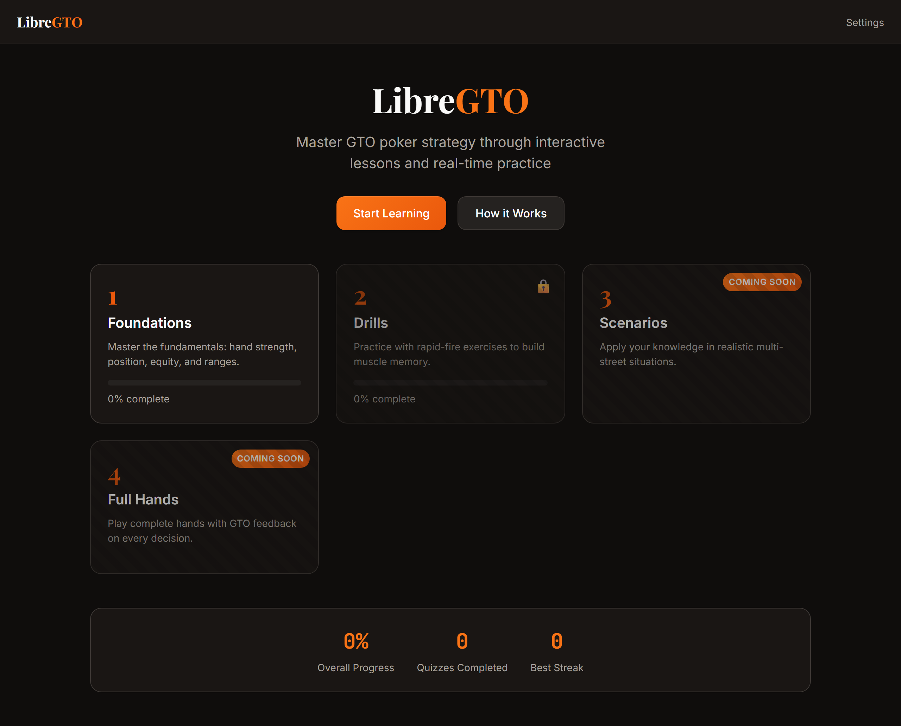
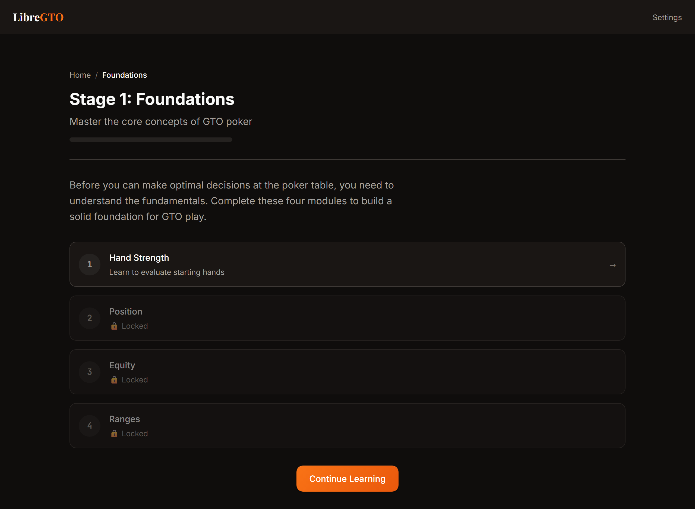
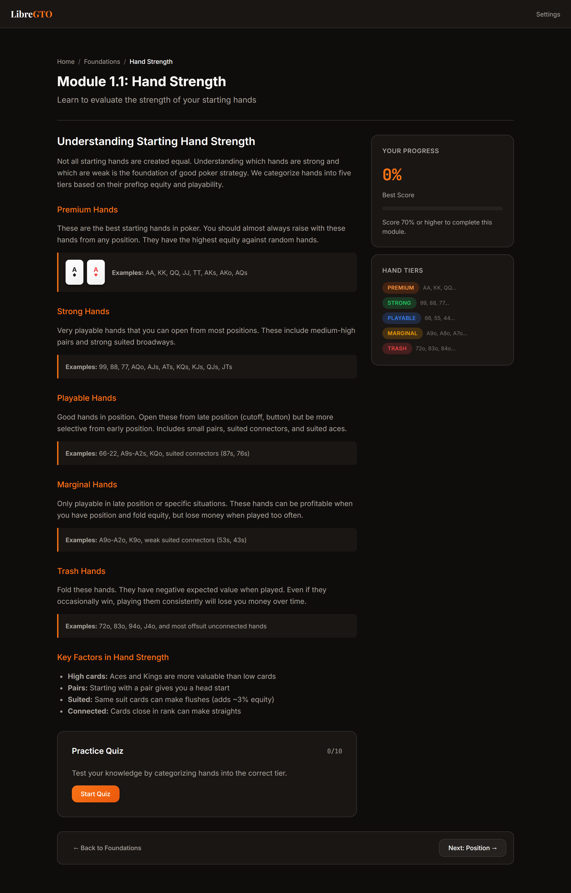
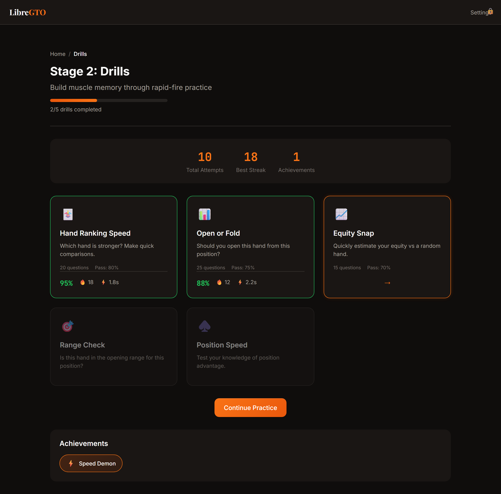
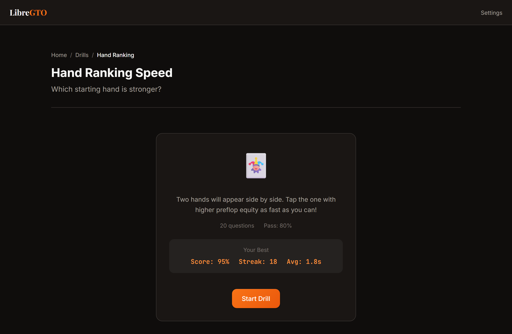

# LibreGTO

**Live Site: [libregto.com](https://libregto.com)**

A 100% free, open-source GTO (Game Theory Optimal) poker trainer. Master preflop ranges, hand strength, position play, and equity through interactive lessons and rapid-fire drills. No subscription, no paywall — forever free.

## Screenshots

### Home


### Foundations — Interactive Lessons


### Module — Hand Strength


### Drills — Rapid-Fire Practice


### Drill — Hand Ranking Speed


## Features

- **Stage 1: Foundations** — Master the core concepts
  - Hand Strength: Learn to evaluate starting hands
  - Position: Understand positional advantage
  - Equity: Calculate winning chances
  - Ranges: Build and read hand ranges

- **Stage 2: Drills** — Build muscle memory with timed practice
  - Hand Ranking Speed: Compare hands under pressure
  - Open or Fold: Position-based opening decisions
  - Equity Snap: Quick equity estimation
  - Range Check: Is this hand in the opening range?
  - Position Speed: Test positional knowledge

- **Interactive Learning**
  - Visual playing cards with suit colors
  - 13x13 range grid for hand visualization
  - Quizzes with immediate feedback
  - Progress tracking with localStorage
  - Achievements and streak tracking

## Getting Started

This is a static site with no build step required. To run locally:

```bash
# Using Python
python -m http.server 8000

# Using Node.js
npx serve .

# Using PHP
php -S localhost:8000
```

Then open `http://localhost:8000` in your browser.

## Design

- **Aesthetic**: "Refined Warmth" — dark theme with burnt orange (#ea580c) accents
- **Typography**: Playfair Display (display), Inter (body), JetBrains Mono (numbers)
- **Responsive**: Mobile-friendly with touch-optimized controls

## Project Structure

```
libregto/
├── index.html          # Main entry point
├── css/
│   ├── variables.css   # Design tokens
│   ├── base.css        # Reset + typography
│   ├── components.css  # UI components
│   ├── pages.css       # Page layouts + animations
│   └── drills.css      # Drill-specific styles
└── js/
    ├── app.js          # Main initialization + routing
    ├── router.js       # Hash-based SPA router
    ├── storage.js      # localStorage persistence
    ├── data/
    │   ├── hands.js    # Hand utilities + equity data
    │   └── ranges.js   # GTO opening ranges
    ├── components/
    │   ├── PlayingCard.js
    │   ├── RangeGrid.js
    │   └── Quiz.js
    ├── modules/
    │   ├── handStrength.js
    │   ├── position.js
    │   ├── equity.js
    │   └── ranges.js
    └── drills/
        ├── index.js
        ├── handRankDrill.js
        ├── openFoldDrill.js
        ├── equitySnapDrill.js
        ├── rangeCheckDrill.js
        └── positionDrill.js
```

## License

MIT
